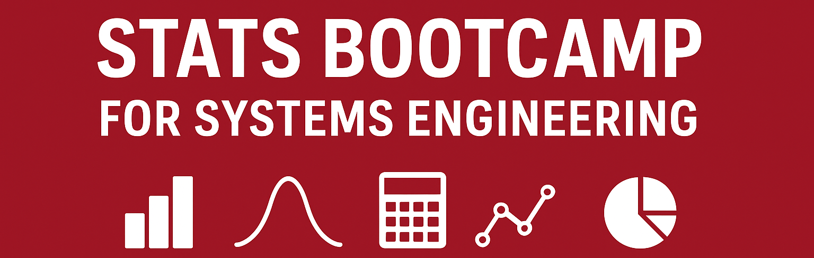
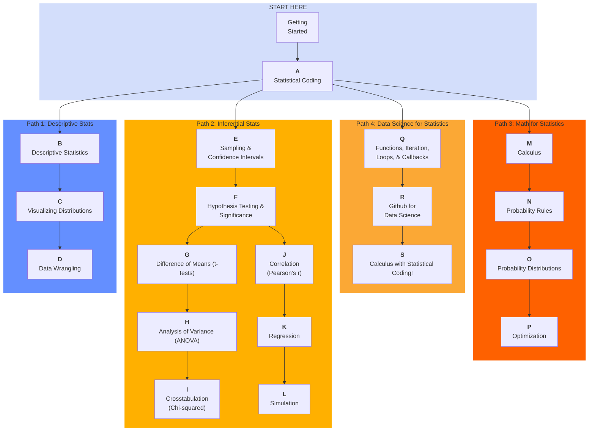

# ⭐ 2026 Statistics Bootcamp for Systems Engineering

Welcome to our Github Repository for the **Statistics Bootcamp** for Cornell University Systems Engineering Program!

- Last Updated: Winter 2026
- Maintainer: Tim Fraser <tmf77@cornell.edu>

---

## Table of Contents

- [Read: Syllabus](docs/syllabus.md)
- [Read: Earn Your Certificate](docs/certificate.md)
- [Read: List of Modules](#modules)
- [Use: CANVAS course site](https://canvas.cornell.edu/courses/75015)

---

## Program Highlights

- 🎥 **Learn statistics and probability through short online modules**, complete with videos and instructor office hours.

- 🎛️ **Customize your bootcamp path**: choose from >15 modules to refresh skills or learn brand-new ones.
Most students complete >5, but you can tackle all modules if you want.

- 📚 **Module options include**: Intro to Statistical Coding, Descriptive Statistics & Distributions, Difference of Means (t-tests), Probability, Simulation, Optimization, Calculus for Probability & Statistics, and more.

- 🐍📊 **Choose your coding environment**: every module includes R and Python scripts, walkthrough videos, and repeatable practice quizzes.

- 🔁 **No grades**: instead, use optional, unlimited-attempt quizzes to check your understanding as you go.

- 🏅 **Earn a Statistics Bootcamp Certificate** by completing quizzes across the modules you select.
Use the certificate to show employers or instructors that you’re trained in core statistical methods.

- Read the [**Syllabus**](docs/syllabus.md) for more details!

---

## Modules

This Stats Bootcamp is made up of several modules, which you may progress through at your own pace, and in your preferred order. Some may be less necessary for you, and you can skip these.

### ⬜ START HERE

- 🧮 Getting Started
- 💻 [A. Statistical Coding](A/)

### 🟦 Path 1: Descriptive Statistics

- 📊 [B. Descriptive Statistics](B/)
- 📈 [C. Visualizing Distributions](C/)
- 💻 [D. Data Wrangling](D/)

### 🟨 Path 2: Inferential Statistics

- 🎲 [E. Sampling & Confidence Intervals](E/)
- 📏 F. Hypothesis Testing & Significance
- 📊 [G. Difference of Means (t-tests)](G/)
- 📊 [H. Analysis of Variance (ANOVA)](H/)
- 📊 [I. Crosstabulation (Chi-squared)](I/)
- 📊 [J. Correlation (Pearson's r)](J/)
- 📊 [K. Regression](K/)
- 📤 [L. Prediction & Simulation](L/)

### 🟥 Path 3: Math for Statistics

- ➗ [M. Calculus](M/)
- 🎲 [N. Probability Rules](N/)
- 🔢 [O. Probability Distributions](O/)
- ↕️ [P. Optimization](P/)

### 🟧 Part 4: Data Science for Statistics

- 🔄 [Q. Functions, Iteration, Loops, and Callbacks](Q/)
- 📦 [R. Using GitHub for Version Control](R/)
- 🔢 [S. TBD](S/)

---

Here are several **recommended** routes through our modules:

---

---

← 🏠 [Back to Top](#Table-of-Contents)
