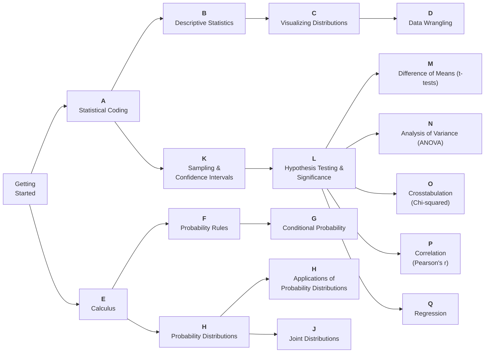

# stats_bootcamp

Welcome to our Github Repository for the **Statistics Bootcamp** for Cornell University Systems Engineering Program!

- Last Updated: Winter 2025
- Maintainer: Tim Fraser <tmf77@cornell.edu>

This Stats Bootcamp is made up of several modules, which you may progress through at your own pace, and in your preferred order. Some may be less necessary for you, and you can skip these.

# Bootcamp Pathways
Here are several **recommended** routes through our modules:

