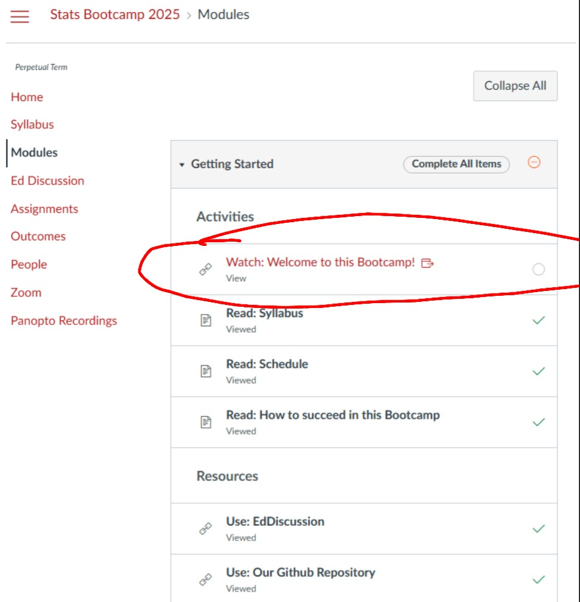
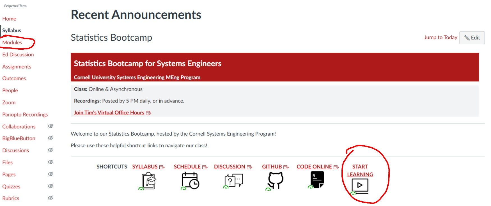

# Getting Started

Welcome to the **Probability and Statistics Bootcamp** (or Stats Bootcamp for short) at Cornell Systems Engineering!

Your instructor is **Tim Fraser, PhD**, an assistant teaching professor in the program specializing in data science, statistics, and computational social science.

---

## Quick Start Checklist

1. **Accept the Invitation Email** to join our Canvas course, sent to your Cornell email address!
2. **Set aside time**: Our Bootcamp runs **January 5 to January 16** (2 weeks). Please set aside time during these two weeks to complete the trainings for our modules.
3. **Check out EdDiscussion**, our message board for asking questions and getting help.

> **Important**: You can start early, but you can't finish late! You are welcome to complete existing modules **early**, before January 5. We will continue to add more modules to the bootcamp, so not all modules will be available until January 5. However, the bootcamp closes on January 16 - so be sure to finish in time!

---

## Frequently Asked Questions

- **Where's our Canvas Course?** Go to [Canvas Course Site](https://canvas.cornell.edu/courses/75015)

- **How do I get started?** On Canvas, navigate to the **Modules** page to our "Getting Started Module", and click on **"Watch: Welcome to this Bootcamp!"**

- **How do I unlock modules?** To get started, you need to finish the **Getting Started module** and **Statistical Coding module**. These intro modules unlock the rest of the course.

- **When are new modules released?** Our course content will be released according to the schedule shown here, with new content every day.

- **Should I learn R or Python?** Check out [**"Read: Which Programming Language Should I choose?"**](https://canvas.cornell.edu/courses/75015/pages/read-which-programming-language-should-i-choose) This may help you in your decision!

- **How to ask questions:** Post questions to peers and your instructor on our **EdDiscussion** site! Highly recommended. Best way to get a fast answer. We encourage you to answer questions for your peers!

- **How to meet with your instructor:** No need to email; You can book a virtual appointment here! See the Welcome video for more information.

- **Video Formatting:** Note that the video format may change slightly day to day, but should be standardized once our full staff team returns from winter break.

---

## Program Highlights

- 🎥 **Learn statistics and probability through short online modules**, complete with videos and instructor office hours.

- 🎛️ **Customize your bootcamp path**: choose from ~15 modules to refresh skills or learn brand-new ones. Most students complete >5, but you can tackle all modules if you want.

- 📚 **Module options include**: Intro to Statistical Coding, Descriptive Statistics & Distributions, Difference of Means (t-tests), Probability, Simulation, Optimization, Calculus for Probability & Statistics, and more.

- 🐍📊 **Choose your coding environment**: every module includes R and Python scripts, walkthrough videos, and repeatable practice quizzes.

- 🔁 **No grades**: instead, use optional, unlimited-attempt quizzes to check your understanding as you go.

- 🏅 **Earn a Statistics Bootcamp Certificate** by completing quizzes across the modules you select. Use the certificate to show employers or instructors that you're trained in core statistical methods.

---

## Next Steps

- Read the [**Syllabus**](syllabus.md) for more details!
- Check out [**How to Succeed**](how_to_succeed.md) for tips on getting the most out of the bootcamp.
- Visit the [**Main Bootcamp Page**](../README.md) to see all available modules.

---

**Very excited to work with you all!**

Best,

**Dr. Tim Fraser**  
Bootcamp Lead Instructor

---

---

← 🏠 [Back to Statistics Bootcamp Home](../README.md)