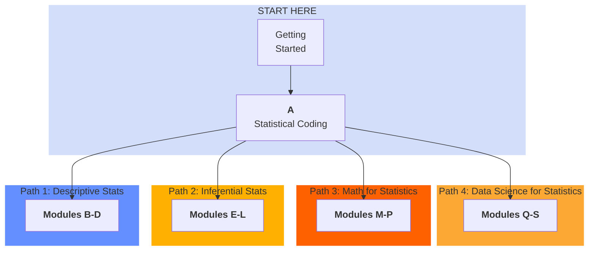

# READ: How to Succeed in this Bootcamp

This bootcamp is a compressed 2 week course! This means each week, we cover LOTS of content! What actions can participants take to succeed in this course?

- **Focus on the topics that you need help with most**! There are no grades from this bootcamp, so try out the sections you feel you need the most support with! Try out 1 or more of these suggested pathways (see chart below).

- **Post and Answer Questions on EdDiscussion**: In a virtual course, our EdDiscussion board can help connect you with colleagues, and can give you faster feedback from your peers than your professor could do alone. You can share ideas, code, math, pictures, and more. Highly recommend!

- **Get to know your colleagues**! 2 people working on the same problem just see more possibilities than one person can alone!

- **Come to Office Hours**! I am eager to tailor this bootcamp to fit your needs and interests. You can help improve this course by telling me ASAP when you run into issues. I am here to support.

---

---

← 🏠 [Back to Statistics Bootcamp Home](../README.md)